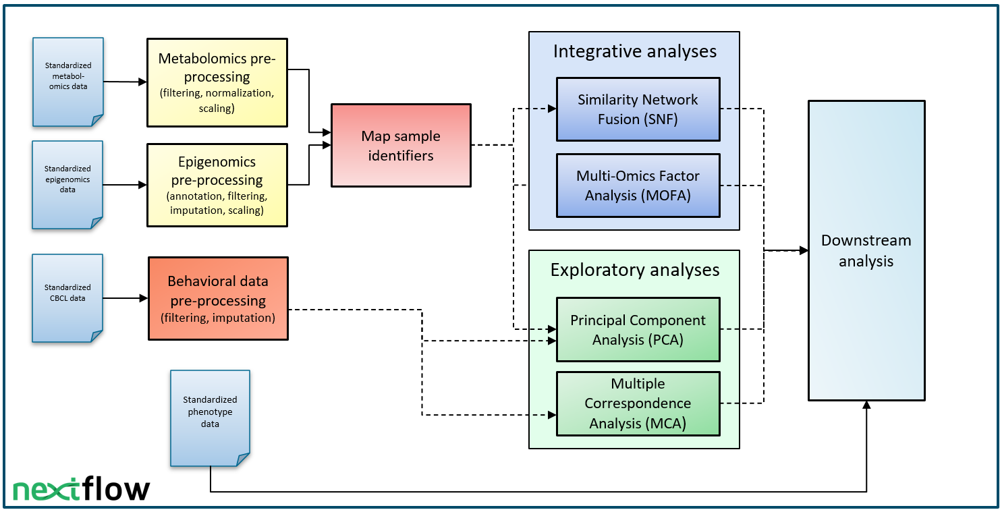

# X-omics ACTIONdemonstrator multi-omics analysis workflow

Here, the ACTIONdemonstrator workflow is made using Nextflow workflow manager. With this workflow, we would like to demonstrate how to create a FAIR workflow. By making this a containerzied/modularized workflow and compatible with WorkflowHub, we consider this a FAIR workflow. 


# Pipeline summary

The NTR-ACTION analysis workflow consists of a set of different pre-processing and analysis steps:


[More complete documentation on the workflow can be found here](Documentation.md)


# WorkflowHub and RO-Crate

The workflow can be found on the  [WorkflowHub page](https://workflowhub.eu/workflows/402) page as well. Different versions of the workflow will be published here. 
The webpage provides an option to download the workflow as Research-Object Crate (RO-Crate). This RO-Crate contains all required workflow elements - including metadata describibing these elements - packed into one `.zip` file. The Jupyter Notebook [ `generate_ro-crate.ipynb`](generate_ro-crate.ipynb) demonstrates how the RO-Crate was made. 


# Requirements

Nextflow and Singularity are required to be installed. To install them on CentOS Linux 7 enable [EPEL](https://docs.fedoraproject.org/en-US/epel/) and run

```
sudo yum -y install conda.noarch
sudo yum -y install singularity.x86_64
```

## Installing Nextflow
```
conda create --name nf
conda activate nf
conda install -c bioconda nextflow:22.04.0
```

See also https://anaconda.org/bioconda/nextflow and https://docs.conda.io/projects/conda/en/latest/user-guide/tasks/manage-environments.html.


# Usage

## Obtain workflow

The workflow RO-Crate can be downloaded from the [WorkflowHub page](https://workflowhub.eu/workflows/402). The RO-Crate contains all necessary files to run the workflow (where this repository does not because of storage limits).

Alternatively, you can clone this git repository (`git clone https://github.com/Xomics/ACTIONdemonstrator_workflow.git`). Then download the missing Infinium MethylationEPIC product file [here](https://emea.support.illumina.com/downloads/infinium-methylationepic-v1-0-product-files.html), for which a placeholder is located in `EPIC_annotation/raw/`.


## Run main workflow:

For detailed instructions on how to run the workflow:
```
nextflow run action.nf --help
```

The typical command to run the workflow is:
```
nextflow run action.nf 
            --output dir/of/choice
            --mtblmcs_values Sythetic_data/synthetic_metabolomics.csv
            --maf_files Synthetic_data/
            --epigenomics_values Synthetic_data/synthetic_epigenomics.csv
            --epigenomics_meta Synthetic_data/synthetic_epigenomics_meta.csv
            --behavioral_data Synthetic_data/synthetic_cbcl_data.csv
            --phenotype_covariates Synthetic_data/synthetic_phenotype_covariates_data.csv
            --ids Synthetic_data/ACTIONdemonstrator_XOmics_IDS_synthetic.csv
```
To run the workflow **in the [Digital Research Environment](https://mydre.org/)**:
- Specify config file: `-c dre.config`
- Specify container files (.sif) dir: `--container_dir /dir/to/containers/`


# Build Singularity containers **locally**

### Create Docker image, convert to Singularity

Define a Dockerfile (example: *Container_files\r-base-phenotypes\Dockerfile*), build Docker image, push to registry, save to archive, and convert to Singularity image.

Run on a local machine:
```{bash}
docker login registry.cmbi.umcn.nl
docker build -t registry.cmbi.umcn.nl/x-omics-action-dataset/action_nextflow/r-base-phenotypes:$VERSION .
docker push registry.cmbi.umcn.nl/x-omics-action-dataset/action_nextflow/r-base-phenotypes:$VERSION
```

Run in a DRE VM (or locally):
```{bash}
docker pull registry.cmbi.umcn.nl/x-omics-action-dataset/action_nextflow/r-base-phenotypes:$VERSION
docker images # to get IMAGE_ID
docker save $IMAGE_ID -o r-base-phenotypes.tar
sudo singularity build r-base-phenotypes.sif docker-archive://r-base-phenotypes.tar
```
# Authors

Radboud University Medical Center, Nijmegen, Netherland:
- Anna Niehues 
- Casper de Visser
- Purva Kulkarni 
- Alain J. van Gool 
- Peter A. C. 't Hoen

Vrije Universiteit Amsterdam, Amsterdam, Netherlands:
- Fiona A. Hagenbeek
- René Pool 
- Dorret I. Boomsma 
- Jenny van Dongen 

Leiden University, Leiden, Netherlands:
- Naama Karu 
- Alida S. D. Kindt 